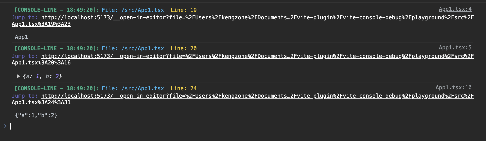

# 📦 vite-console-debug

[](https://www.npmjs.com/package/vite-console-debug)

#### 🌈 Features

- 🍰 Console Debug for vite and rollup.

## 📦 Installation

```bash
npm i vite-console-debug@latest -D
```

#### support vite and rollup.

<details>
<summary>Basic</summary><br>

```ts
import { defineConfig } from 'vite';
import react from '@vitejs/plugin-react';
import ConsoleDebug from 'vite-console-debug/vite';
// https://vitejs.dev/config/
export default defineConfig({
  plugins: [react(), ConsoleDebug()],
});
```

<br></details>

## 🌸 DefaultConfiguration

```typescript
export interface PluginOptions {
  exclude?: string[];
  noConsole?: boolean;
  disableLaunchEditor?: boolean;
}
```

## Demo


