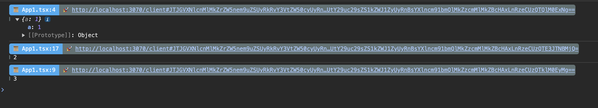

<p align="center">
<a href="https://www.npmjs.com/package/vite-console-debug" target="_blank" rel="noopener noreferrer">
</a>
</p>

<p align="center">
  A plugin console debug for <a href="https://vitejs.dev/" target="_blank" rel="noopener noreferrer">Vitejs</a>
</p>

<p align="center">
  <a href="https://www.npmjs.com/package/vite-console-debug" target="_blank" rel="noopener noreferrer"></a>
  <a href="https://www.npmjs.com/package/vite-console-debug" target="_blank" rel="noopener noreferrer"></a>
  <a href="https://bundlephobia.com/result?p=vite-console-debug" target="_blank" rel="noopener noreferrer"></a>
  <a href="https://github.com/hunghg255/vite-console-debug/graphs/contributors" target="_blank" rel="noopener noreferrer"></a>
  <a href="https://github.com/hunghg255/vite-console-debug/blob/main/LICENSE" target="_blank" rel="noopener noreferrer"></a>
</p>

## 🌈 Features

- 🍰 Console Debug for vite and rollup.

## 📦 Installation

```bash
npm i vite-console-debug@latest -D
```

## support vite and rollup.

<details>
<summary>Basic</summary><br>

```ts
import { defineConfig } from 'vite';
import react from '@vitejs/plugin-react';
import ConsoleDebug from 'vite-console-debug/vite';
// https://vitejs.dev/config/
export default defineConfig({
  plugins: [react(), ConsoleDebug()],
});
```

<br></details>

## 🌸 DefaultConfiguration

```typescript
export interface PluginOptions {
  exclude?: string[];
  noConsole?: boolean;
  disableLaunchEditor?: boolean;
}
```

## Demo


